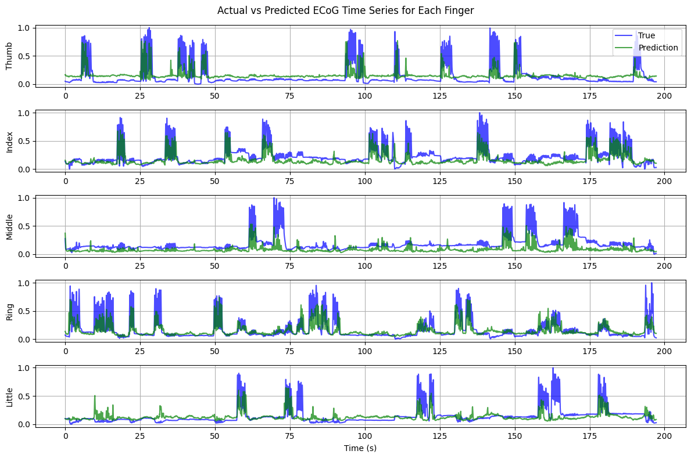
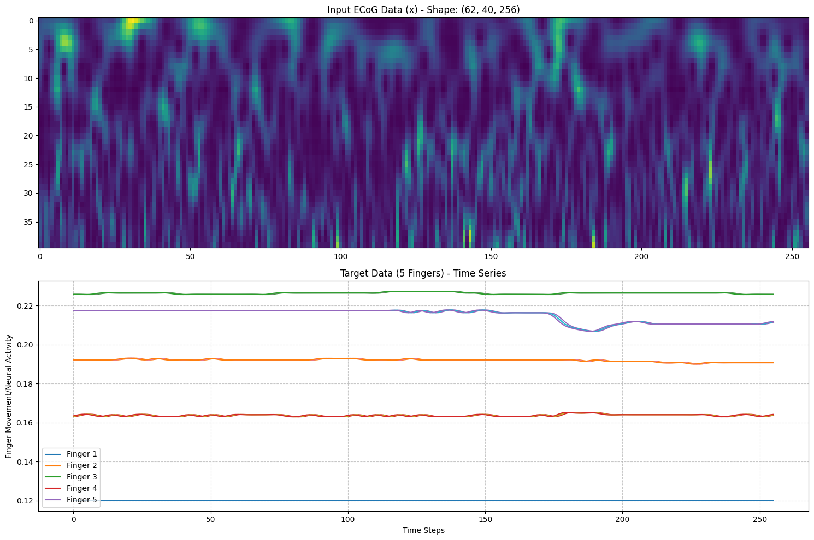
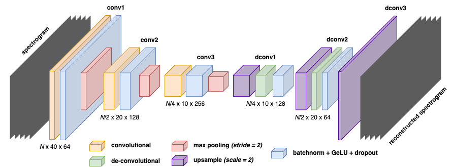
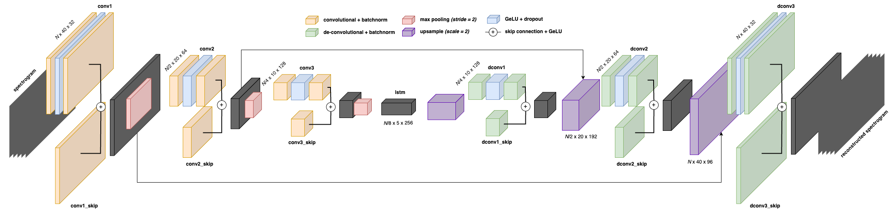

<h1 align="center">FingerECoG-BCI</h1>

Prediction of finger flexion from ECoG data using deep CAE-LSTM spectrogram analysis. View our report [here](https://docs.google.com/document/d/1SsYuvWzw3CTIzsvCW63bwvC5-v-H4vgi7btYLSRzt8s/edit?usp=sharing).

<p align="center">
  
  <em>Sample predictions of our final model.</em>
</p>

## Dataset

We use dataset 4 from BCI IV Competition. It contains ECoG signals recorded together with fingers movements. We then preprocess the data by synchronizing (upsampling/downsampling) the ECoG and finger glove data frequencies, and filter and transform the ECoG wavelets into spectrograms.

<p align="center">
  
  <em>Spectrogram and finger flexion visualisation for subject 1.</em>
</p>

More details about the dataset and the BCI competition can be found [here](http://www.bbci.de/competition/iv/). You may also refer to `prepare_data.ipynb` for more preprocessing information.

## Models

By transforming the waveform timeseries ECoG data into spectrograms, we leverage on the new-found homophilic property of the spectrogram to train convolutional autoencoders (CAE) for prediction flexion patterns.

Our vanilla encoder-decoder model architecture is as follows. We trained the model on subject 1's data and got an overall Pearson correlation coefficient of **0.3501**, which is less than ideal.

<p align="center">
  
  <em>Vanilla CAE model with 3 conv-deconv layers; with batch-norm, dropout, and GeLU activation.</em>
</p>

We built a deep CAE as our final model by incorporating an LSTM RNN into the bottleneck layer of the CAE. This leverages on both the homophilic patterns of the spectrogram as well as captures the time-series-based patterns within the data from the LSTM, giving the model as much information as possible to extract patterns.

<p align="center">
  
  <em>Deep CAE-LSTM hybrid model with 3 conv-deconv blocks, each with 2 conv layers; with batch-norm, dropout, skip connections, and GeLU activation.</em>
</p>

## Project Information

The project folder structure is organised as follows:

```text
.
├── data/
│   ├── finger_flex_cropped_val.npy
│   ├── finger_flex_cropped.npy
│   ├── sub1_comp.mat
│   ├── sub1_testlabels.mat
│   ├── sub2_comp.mat
│   ├── sub2_testlabels.mat
│   ├── sub3_comp.mat
│   ├── sub3_testlabels.mat
│   ├── X_spectrogram_cropped_val.npy
│   └── X_spectrogram_cropped.npy
├── src/
│   ├── __init__.py
│   ├── constants.py
│   ├── data.py
│   ├── encoder_decoder.ipynb
│   ├── eval.py
│   ├── model.py
│   ├── prepare_data.ipynb
│   ├── run_lstm.ipynb
│   └── train_sub1_lstm.ipynb
│   └── train_sub2_lstm.ipynb
│   └── train_sub3_lstm.ipynb
├── requirements.txt
└── sub1.pth
└── sub2.pth
└── sub3.pth
```

The `/data` folder contains all original and preprocessed data files used for training. This includes the cropped and up/down-sampled ECoG signals and the spectrogram conversion.

The `/src` folder contains Jupyter notebooks used to preprocess the data (`prepare_data.ipynb`), and the two models - the vanilla autoencoder (`encoder_decoder.ipynb`) and the CAE-LSTM hybrid (`train_subX_lstm.ipynb`, `run_lstm.ipynb`) - as described above. The remaining Python files are helper files used across the various Jupyter notebooks.

The best-performing models per subject have been saved into their respective `.pth` files, which can be loaded for testing.

### How to Use

1. Download the dataset and unzip the files into a `/data` folder.
2. Install the Python requirements using

```shell
cd PATH_TO_ROOT_DIRECTORY/
pip install -r requirements.txt
```

3. Run the data preparation notebook `prepare_data.ipynb`, followed by the model of your choosing.

To run the training workflow for subject 1, you would need to first set the `SUBJECT_ID` to be equal to `“sub1”` in `constants.py`, run `prepare_data.ipynb` (if not previously run), then `train_sub1_lstm`.ipynb. Similar workflows for the other 2 subjects.

To run the test workflow for subject 1 you would need to first set the `SUBJECT_ID` to be equal to `“sub1”` in `constants.py`, run `prepare_data.ipynb` (if not previously run), then `run_lstm.ipynb`. Similar workflows for the other 2 subjects.

## Acknowledgements

This project is an undertaking of SUTD's 50.039 Theory and Practice of Deep Learning. We also reference the following research articles as cited below:

```
@article{bcicompiv2007,
  title={Decoding Two-Dimensional Movement Trajectories Using Electrocorticographic Signals in Humans},
  author={Schalk, G., Kubanek, J., Miller, K.J., Anderson, N.R., Leuthardt, E.C., Ojemann, J.G., Limbrick, D., Moran, D.W., Gerhardt, L.A., and Wolpaw, J.R.},
  journal={J Neural Eng, 4: 264-275},
  year={2007}
}

@article{fingerflex2022,
  title={FingerFlex: Inferring Finger Trajectories from ECoG signals},
  author={Lomtev, Vladislav and Kovalev, Alexander and Timchenko, Alexey},
  journal={arXiv preprint arXiv:2211.01960},
  year={2022}
}

@article{GramfortEtAl2013,
  title = {{{MEG}} and {{EEG}} Data Analysis with {{MNE}}-{{Python}}},
  author = {Gramfort, Alexandre and Luessi, Martin and Larson, Eric and Engemann, Denis A. and Strohmeier, Daniel and Brodbeck, Christian and Goj, Roman and Jas, Mainak and Brooks, Teon and Parkkonen, Lauri and H{\"a}m{\"a}l{\"a}inen, Matti S.},
  year = {2013},
  volume = {7},
  pages = {1--13},
  doi = {10.3389/fnins.2013.00267},
  journal = {Frontiers in Neuroscience},
  number = {267}
}
```
